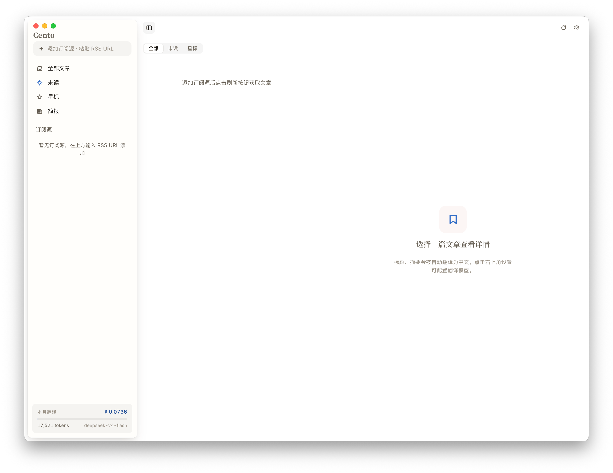
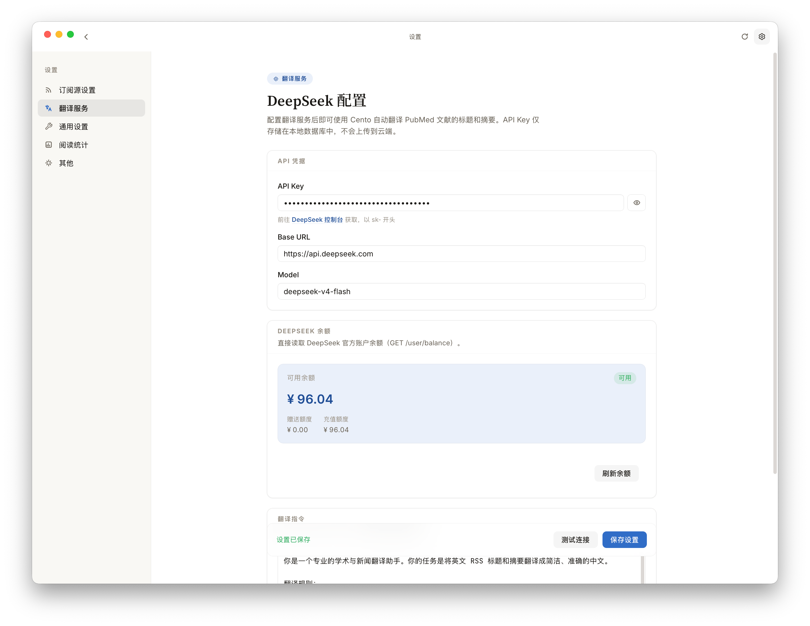
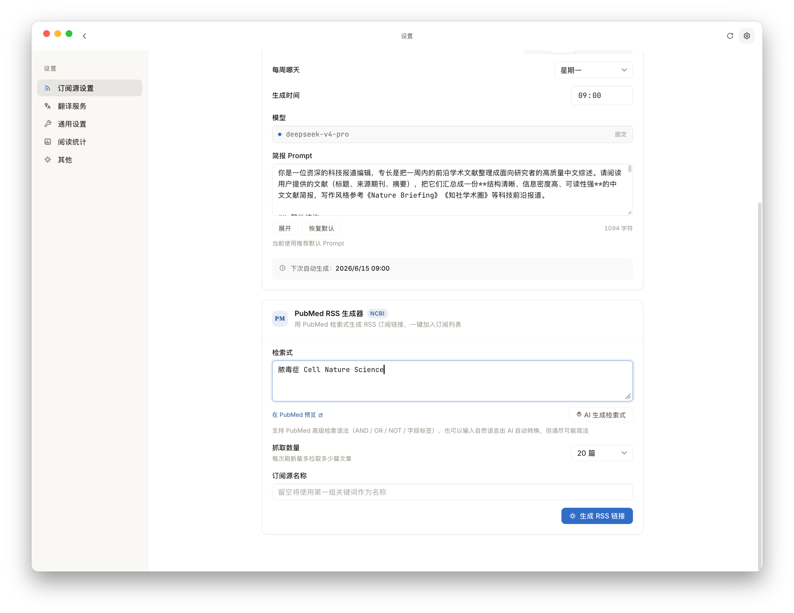
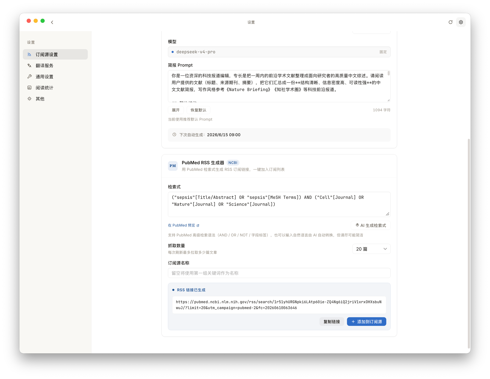
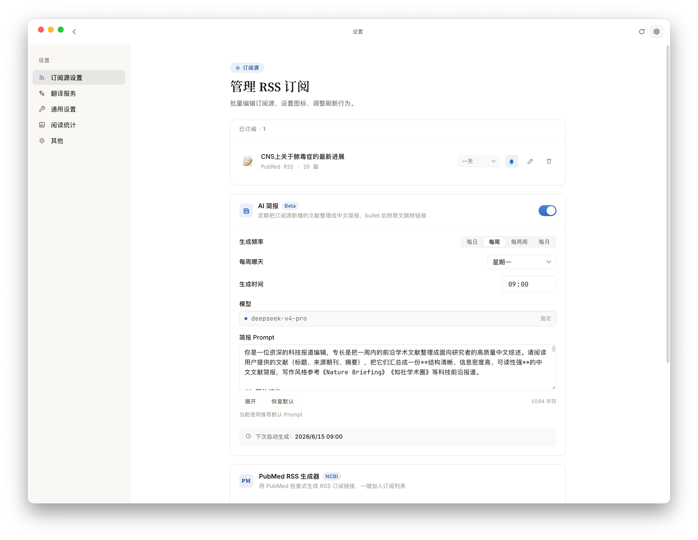
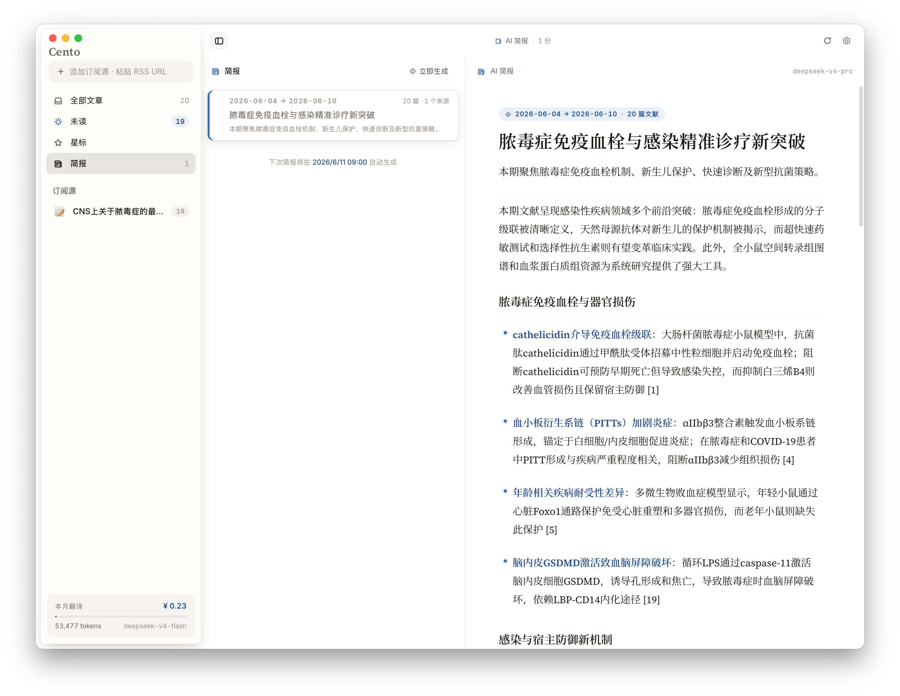
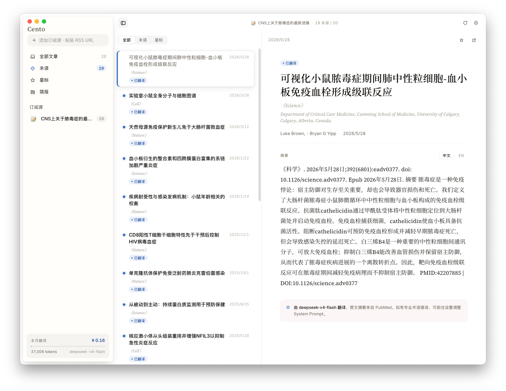
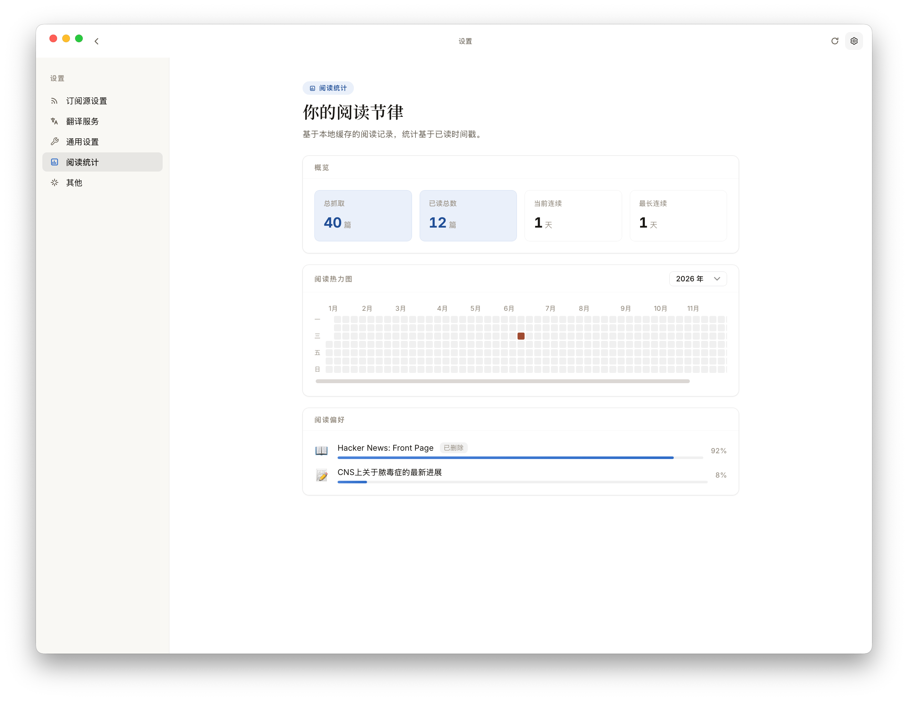

# RSS Reading

RSS Reading 是一个面向中文用户的轻量级 RSS 阅读器，当前版本基于 [itsdrchen/Cento](https://github.com/itsdrchen/Cento) 二次开发。它用 DeepSeek API 翻译英文 RSS 标题和摘要，帮助用户快速判断一篇文章是否值得打开原文阅读。

## 致谢

- 感谢 [itsdrchen/Cento](https://github.com/itsdrchen/Cento) 提供原始代码与产品基础，本项目在其之上继续迭代。

[](LICENSE)
[](https://tauri.app)
[]()

## 技术栈

- **桌面壳**：Tauri 2
- **前端**：HTML + CSS + 原生 JavaScript（无框架）
- **后端**：Rust + Tauri commands
- **存储**：SQLite，本地路径为 `~/Library/Application Support/io.github.liuenqian.rssreading/rss reading.db`
- **翻译**：DeepSeek API

## 核心功能

- 添加、展示、重命名、删除 RSS 订阅源；每个订阅源可自定义 emoji 图标、刷新频率、桌面通知开关
- 后端定时调度器自动按订阅源配置的间隔抓取，关闭窗口后仍可在托盘后台运行
- 抓取时自动翻译标题与摘要，结果缓存到 SQLite；受信号量控制，避免突发请求
- 中文源自动识别：当订阅源标题或摘要本身即为中文（CJK 字符占比 ≥ 30%）时，管线无感跳过翻译，不消耗 token、不产生 UI 噪音
- 支持已读/未读状态，点开文章后自动标记为已读；支持星标（客户端）
- 列表顶部 segmented control 切换 全部 / 未读 / 星标
- 详情面板展示中文译标题 + 英文原标题 + 期刊 + 主要作者 + 主要通讯地址 + 发表日期 + Abstract，可切换 中文 / EN 视图
- 在系统浏览器中打开原文链接，sticky 底栏显示 DOI（从 link 自动提取）
- 阅读统计：GitHub 风格热力图、当前 / 最长连续阅读天数、订阅源阅读偏好 top 5
- **本月翻译用量**：直接读取 DeepSeek API 返回的 `usage` token 字段，按官方价目表（cache hit / miss / output 分开）换算成 CNY；同时提供 DeepSeek 官方余额查询通道
- macOS 系统通知：订阅源更新时弹出横幅；测试通知按钮验证通道是否通畅
- 浅色 / 深色主题、4 色强调色、3 档阅读字号
- 状态栏菜单（tray icon），未读数显示在 icon 右侧

## 本地运行

需要：[Node.js](https://nodejs.org) 18+、[Rust](https://www.rust-lang.org/tools/install) stable、Xcode Command Line Tools。

```bash
git clone https://github.com/liuenqian/RSS_reading.git
cd RSS_reading
npm install
npm run tauri dev
```

首次启动会编译 Rust 依赖，约需 3–5 分钟。启动后在设置页填写 DeepSeek API Key，并先点击「测试连接」。

## 打包 DMG

```bash
npm run tauri build
```

产物：

```text
src-tauri/target/release/bundle/macos/RSS Reading.app
src-tauri/target/release/bundle/dmg/RSS Reading_<version>_aarch64.dmg
```

Release profile 已开启 `lto = true`、`codegen-units = 1`、`strip = true`、`opt-level = "z"`，单架构 DMG 通常在 3–4 MB 之间。

## 通知调试

dev 模式（`tauri dev`）下，未签名二进制无法直接通过 `UNUserNotificationCenter` 推送横幅，RSS Reading 会自动回退到 `osascript`，但 banner 会以 "Script Editor" 名义出现。如需在 dev 模式下显示 RSS Reading 真实 icon，可：

```bash
brew install terminal-notifier
npm run tauri build   # 注册 RSS Reading.app 的 bundle identifier 到 LaunchServices
```

生产环境（直接运行 `RSS Reading.app`）则自动使用原生通知插件，无需上述步骤。

## 订阅源建议

医学和生命科学期刊优先使用 PubMed 生成的 RSS，而不是出版社官网 RSS。PubMed 的 `<description>` 通常直接包含完整 Abstract，摘要覆盖率明显高于 ScienceDirect 等出版社 RSS。

在 PubMed 搜索期刊时使用期刊字段，可以使用自然语言通过app的AI自动转换成pubmed的索引格式，然后通过页面里的 "Create RSS" 生成带 hash 的 RSS URL。PubMed 索引可能比出版社官网晚 1-3 天，但对文献分诊更稳定。

对于其他RSS，可直接在首页添加订阅源，暂不考虑抓取全文的功能

## 使用方法

在 [Release 界面](https://github.com/liuenqian/RSS_reading/releases/latest) 下载适配你的设备的最新版本：

| 平台 | 文件 |
|---|---|
| macOS · Apple Silicon (M1/M2/M3/M4) | `RSS Reading_*_aarch64.dmg` |
| Windows · x64（**预览版，欢迎反馈**） | `RSS Reading_*_x64-setup.exe` 或 `RSS Reading_*_x64_en-US.msi` |

**macOS 安装**：由于没有预算，因此没有做 macOS 的签名认证版，安装后若显示无法打开，可在系统设置——隐私里选择「仍要打开」

**Windows 安装**：双击 `.msi` 或 `.exe` 即可。Windows Defender 可能拦截未签名的安装包，点击「更多信息」→「仍要运行」即可。Windows 版目前为预览，主要功能可用但未在所有版本 Windows 上验证，欢迎在 issue 反馈问题。

## 界面介绍



↑↑↑主界面就是简单的三栏设计，点击右上角「设置」可进入详细设置页面



↑↑↑首先推荐设置的是DeepSeek的API Key，由于能力有限且不想让app太复杂，且deepseek-v4-flash模型能力在翻译方面已足够好用且便宜，因此这里模型就固定了，以减少操作复杂性。你只需在DeepSeek官网控制台页面充值即可（点击页面超链接可直接跳转），不用充太多，十块钱可以用很久，目前统计翻译100条文献标题及摘要大约1毛钱



↑↑↑订阅源设置界面是你往后主要会使用的页面，为降低RSS使用门槛，我在这里设计可使用自然语言生成pubmed索引链接，你可以直接输入你锁关注领域的关键词，可以是中文，但建议不要关键词太多



↑↑↑这里可以看到，app直接将输入的「脓毒症 Cell Nature Science」转换成了pubmed可识别的索引格式并生成了RSS订阅链接。另外，如果你不用来追踪文献，仅仅是用来订阅一些外文的RSS源，也是可以的，直接在首页左栏输入框中添加订阅源即可



↑↑↑在管理订阅源的部分，你可以设置订阅源的图标、刷新频率、是否通知、修改订阅源名称等



↑↑↑同时我也引入了AI简报功能，可以定期帮你总结你的订阅源一段周期内的文献，如图示例。当然你也可以在设置中自行修改Prompt以获得自定义的简报形式。当然简报这里使用的模型是deepseek-v4-pro



↑↑↑这是添加了订阅源之后的主界面形式，文献标题及摘要均自动翻译，也能够抓取第一作者和通讯作者以及第一通讯单位这些主要信息，方便你快速判断这篇文献是否值得精读。右上角可直接跳转文献源网站



↑↑↑还做了统计页面，通过热力图方便看到论文抓取阅读分时间及数量分布

## 文档入口

- [项目结构](docs/project-structure.md)
- [架构说明](docs/architecture.md)
- [路线图与排除清单](docs/roadmap.md)
- [UI 设计规范](docs/design.md)
- [Prompt 设计](docs/prompts.md)
- [Agent 协作规则](AGENTS.md)

## 产品想法由来

首先得承认，我完全没有系统学习过代码编写，因此倘若有不专业的显得很业余的地方，还请见谅

我的本专业是临床医学，在过去的硕博生活中，阅读文献是日常生活的重要一部分，但英语水平也一般，因此借助翻译工具是难免。之前曾热衷于使用 Zotero 来管理翻译我的文献，也装了很多插件，后来发现还是在官网阅读更加纯享，更加便捷，如果遇到特别好的文献再用 Obsidian 管理笔记，因此逐渐就放弃 Zotero 了

但这也带来一个麻烦，Zotero 自带的 RSS 追踪功能还是蛮好用的，又不想仅仅为了这一个功能再去下载一个大几百 MB 的软件，已经过了喜欢那些花里胡哨功能的年纪，现在更喜欢轻量的且功能聚焦的 app

市面上好用的 RSS 阅读器有很多，不乏很多轻量的界面好看的 RSS 阅读器，但试用了许多，总觉得无法满足我的需求。而对于希望追踪多个领域进展的人来说，能够快速自动翻译标题和摘要来判断文章的价值就尤为重要，是的，其实到某一时期，最重要的是筛选粗读文献

大模型能力突飞猛进的今天，我想，为何不将抓取后的文献标题和摘要自动翻译，从而快速筛选文献呢？

感谢 Claude、Codex、DeepSeek，让我通过 vibe coding 实现了我的想法。作为一个完全完全对代码不懂的人，就是在一年前我都不敢想象我能做一个 app 出来

由于功能比较简单聚焦，因此最难的反而是界面UI设计了，这里主要用了 Claude design，反反复复修改，最后效果总体还满意，但距离我想象的 macOS 原生质感还是差了一些，如果有大佬愿意伸出援手来拯救，真的会非常感谢

最后，app 保留了我的初心，整体安装包在 5MB 左右，舍弃了很多传统 RSS 阅读器的功能。

**RSS Reading 不做完整 RSS 阅读器、文献管理器或知识库**。它的核心问题只有一个：让用户更快判断"这篇内容值不值得读原文"。

这段时间真的获益很多，感谢这个时代可以让每个人都能像动笔写文章一样来写一个自己想要的工具。当然必须要向专业的代码者致敬，在这个过程中才知道「古法编程」的难度，并且时至今日我也认为，AI 虽然可以让工具跑起来，但专业的人工审核监督会变得更加有价值。

最后诚恳希望各位多多善意建议，尽量不要拍砖，如果能帮助我把这个app做更美丽优雅好用，那就更感激了

## License

[MIT](LICENSE) © itsdrchen

## Tip

感谢[LINUX DO](https://linux.do/latest)
